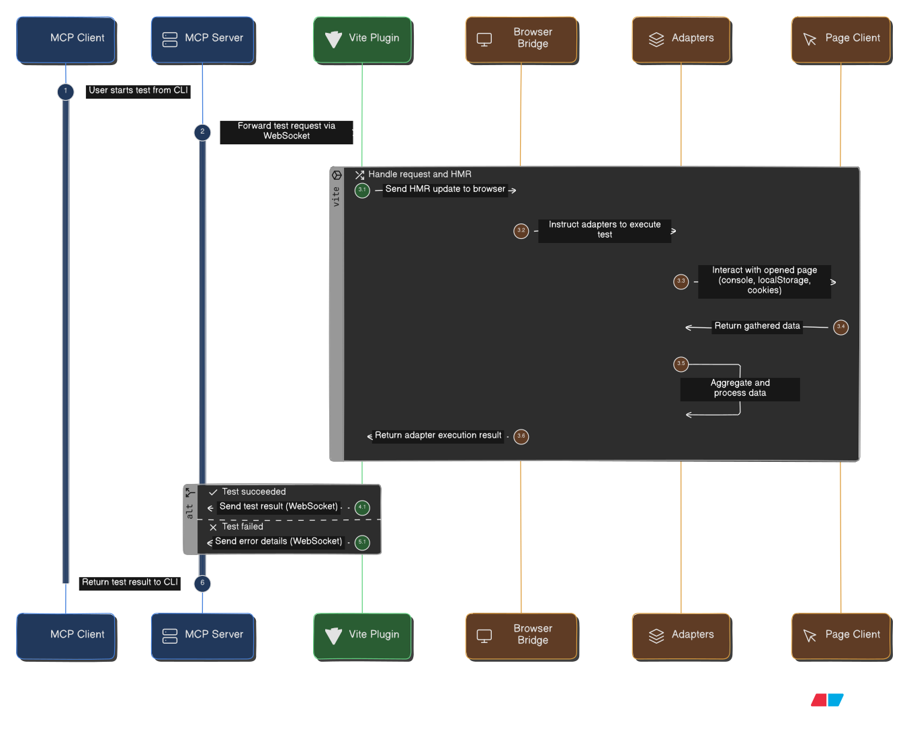

## HOW is this built/work?

#### Bridge

The **browser-bridge** is a critical component that connects the MCP server (running in Vite) with the browser environment. It enables MCP tools to access browser APIs that are only available in the browser context.

### Why Do We Need It?

`MCP` tools need to access browser-specific APIs:

- **Console messages** - Only available in the browser's console
- **localStorage** - Browser storage API
- **sessionStorage** - Browser session storage
- **Cookies** - Browser cookie API
- **DOM** - Document Object Model, Component Tree, Routes
- and more adapters being added on

These APIs **cannot** be accessed from internal. The browser bridge runs **inside the browser** and executes the adapters there, then sends the results back to the MCP server.

## How It Works Under the hood

## Communication Flow

1. **MCP Client** calls a tool (e.g., `read_console`)
2. **MCP Server** receives the tool call via HTTP.
3. **Vite Plugin** dispatches the tool call via WebSocket/HMR to the browser.
4. **Browser Bridge** receives the tool call via `import.meta.hot.on('mcp:tool-call')`
5. **Browser Bridge** executes the adapter in the browser context
6. **Browser Bridge** sends the result back via `import.meta.hot.send('mcp:tool-result')` via `server.ws`.
7. **Vite Plugin** receives the result and resolves the promise
8. **MCP Server** returns the result to the MCP client

## Debugging Steps

1. Check browser console for `[MCP Bridge] Ready and waiting for tool calls`
2. Check dev server logs for `🔌 WebSocket client connected` and `🔌 MCP Bridge ready!`
3. Check if `server.ws.send()` is actually sending messages
4. Verify the HMR event format matches what Vite expects
